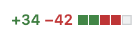

# Mini-Project 

The goal of this mini-project is to provide you with an opportunity to develop a website based on a similar technology stack that you will be using for your final project. To expand on your github skills and knowledge, you will also be deploying the website through Github Pages.

## Instructions
1. Watch the following video to learn more about Github Pages and deploying your website
   - [Getting Started with GitHub Pages](https://youtu.be/QyFcl_Fba-k?si=oH0L3BZo8h9x1Yby)
2. Come up with a simple website idea
   - I recommend using this opportunity to create a personal/portfolio website.
   - Refer to website rubric/requirements below for more details
3. Set up your website repository on Github (hint: the repo name should be `your-username.github.io`)
   - Refer to [Github's website](https://pages.github.com/) to learn more about the steps on how to accomplish this
4. Develop a wireframe of your website using a tool we discussed in class
   - You're encouraged to use similar tools that you'd be using for your project
   - Refer to resources below for guides on how to create a wireframe
5. Develop your website using your preferred technology stack
   - This could be a great opportunity to learn a new technology stack, to prepare for your class project
   - Refer to [resources page](https://parsa-rajabi.github.io/CMPT-276/#/resources) on canvas/course website for more information
6. Deploy with Github Pages
   - Refer to [Github's website](https://pages.github.com/) to learn more about the steps on how to accomplish this
7. Answer the follow-up questions included in the repository

## Requirements

Although this mini-project is open-ended, I highly recommend developing a personal website to add more projects to your portfolio which will be helpful for your future job applications.

Note: personal websites are _meant_ to be **personal**. Try to make it unique to you and only share information you're comfortable with. Due to privacy reasons, you can choose to develop another website that still meets the requirements of this mini-project. If you choose to develop another website, please consult with a TA to ensure it meets the requirements of this mini-project.

### Personal Website

Your personal website could include some of the following elements (these are just suggestions)

- Short bio about who you are + picture
- List of your previous/current projects + links to github repo
- Programming skills and frameworks you're comfortable with (could be combined with the item above)
- Link to professional social media i.e. LinkedIn, Github etc.
- Work experience
- Volunteer experience
- Education
- What you’re passionate about (personal hobbies, interests, etc.)
- Link to resume/CV
- Any other information you'd like to share

## Not sure where to start?

In case you're not sure where to start, I recommend checking out [Scrimba's Frontend Developer Career Path](https://scrimba.com/the-frontend-developer-career-path-c0j) module that wll guide you on web dev basics such as HTML, CSS and Javascript. While most of the content is locked for "subscribers", as a Github student developer, [Scrimba offers a free subscription for 1 month](https://scrimba.helpscoutdocs.com/article/19-do-you-offer-student-discounts). 

You are not expected to complete the module as part of this mini-project, but it could be a great resource to get you started on web development.

## Website Rubric

- `[17 marks total]` Website Elements (refer to below for more details)
- `[17 marks total]` Github items (refer to below for more details)
- `[4 marks total]` Follow-up questions
- `[7 marks total]` Github Video + Questions

### Website Elements 

- `[5 marks]` Website's wireframe is organize, easy to understand and the provided description matches the wireframe 
- `[1 mark]` Website includes a bio/overview
- `[1.5 marks (0.25 each)]` Website includes at least 6 hyperlinks to external websites
- `[5 marks]` Website adheres to all 10 usability heuristics (Nielsen's 10 Usability Heuristics)
- `[1 mark]` Website has a custom [favicon](https://favicon.io/tutorials/what-is-a-favicon/)
- `[1.5 marks (0.5 mark each)]` Website has at least 3 separate sections/tabs with information
- `[1.5 marks (0.5 mark each)]` Website has at least 3 images with appropriate alt text
- `[0.5 mark]` Website content is engaging and free of spelling/grammar errors

#### Out of Scope

While this is a great opportunity to learn new technologies, please note that the following are out of scope for this mini-project:

- Responsive design (your website should be accessible on a desktop browser only) e.g. no mobile or tablet support
- SEO optimization
- Web analytics
- Custom domain
- Database integration
- User authentication
- Server-side scripting
- Any other advanced features that are not covered in this course

#### Acceptable Technologies for this Mini-Project

I encourage you to use this opportunity to modify existing templates, frameworks, and libraries to make your website development process easier/faster. Refer to our [resources page](https://parsa-rajabi.github.io/CMPT-276/#/resources) for more information. 

### Github Items 

- `[10 marks (1 mark each)]` Write, complete and merge at least 10 github issues using branches and pull requests. These issues must have:
   - Description of the issue, including acceptance criteria or definition of what "done" means
   - Assignees (you can assign yourself)
   - Labels (Create at least 3 new labels for your repo)
   - Milestone (Create a `milestone` for your git repo and use it in your github issues)
   - Project (Create a github project via the `Projects` tab on your repo and use it in your github issues)
- `[1 mark]` Git repo has a License associated with it (MIT, Apache, etc.) and you've provided an explanation of why you chose that license
- `[6 marks]` Website is deployed and accessible with Github Pages

### Github Etiquette

As you work on your mini-project, you should be making regular commits to your website repository. Each commit should have a meaningful message that describes what you did. You are graded on your use of git, including commit messages. Commit messages that do not provide a meaningful description of the changes made will result in a deduction of `1%` marks, each. 

For this mini-project, we expect to see a minimum of `30 meaningful commits` (total) to the website repository (on average, this translates to ~3 commits per each issue/branch). You should break up your work into small, manageable tasks and commit your changes as you complete each task. Repositories with less than the specified number of commits will be penalized with a deduction of `1%` for each missing commit.

### Resources for Wireframing

- https://www.interaction-design.org/literature/topics/wireframe
- https://www.figma.com/resource-library/what-is-wireframing/
- https://balsamiq.com/learn/articles/what-are-wireframes/
- https://www.uxdesigninstitute.com/blog/what-is-wireframing/
- https://miro.com/wireframe/what-is-a-wireframe/

### Follow-up Questions `[4 marks]`

Answer the following questions on this repo's [README.md](README.md) file (NOT on your website repo's)

1. `[0 marks]` Links to your project repo AND website 
   - If the repo is private, make sure to add the teaching team as collaborators for marking purposes.
   - Submitting a private repo without adding the teaching team as collaborators will result in a deduction of `-10%` of the lab grade. 
   - Failure to include your repo/website in [README.md](README.md) link will result in a mark of 0 until the link is provided, after which then a late penalty (`-25%`) will be applied
2. `[0.5 marks]` Provide an overview of your website and all the elements that it includes
3. `[1 marks]` What is a favicon and why is it important for SEO?
4. `[1 marks]` What are Github Pages? How do they differ from a regular webpage?
5. `[1 marks]` What are Github Actions? Provide an example of a `.yml` file that you used in your lab and explain what it does, line by line in plain English.
6. `[0.5 mark]` What technology stack did you use to develop this website? Why did you choose this stack?


## Github Video + Questions `[7 marks]`

Watch the video below and answer the questions:

- [Git & GitHub Tutorial for Beginners #9 - Merging Branches (& conflicts)](https://youtu.be/XX-Kct0PfFc)
- [Git & GitHub Tutorial for Beginners #11 - Collaborating on GitHub](https://youtu.be/MnUd31TvBoU)

### Questions

1. `[2 marks]` In 3-4 sentences, explain what pull requests (PRs) are and their purpose.

2. `[1 marks (0.5 each)]` Describe what the green and red colours indicate when viewing `Files changed` on a pull request.  

   

3. Suppose you have the following branches on github (`develop`, `test` and `production`) and you are currently on the `develop` branch.

   a. `[2 marks]` In your own words, describe what following git command does:

      - `git merge test`

      After running the git command above, you recieve the following error in your `README.md` file:

      ```shell
      Line 1: <<<<<<< HEAD
      Line 2: this is some content to mess with
      Line 3: content to append
      Line 4: =======
      Line 5: totally different content to merge later
      Line 6: >>>>>> test
      ```

   b. `[1 mark]` Explain why this message has appeared and what it means.

   c. `[1 mark]` Identify which line(s) of code belong to which branch (`develop` and `test`)
