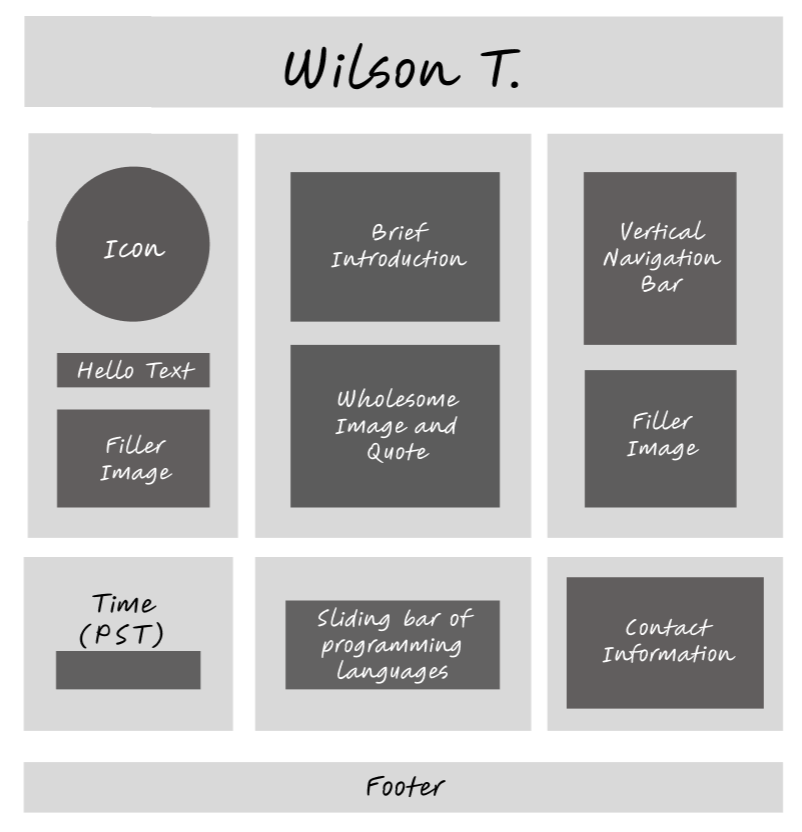
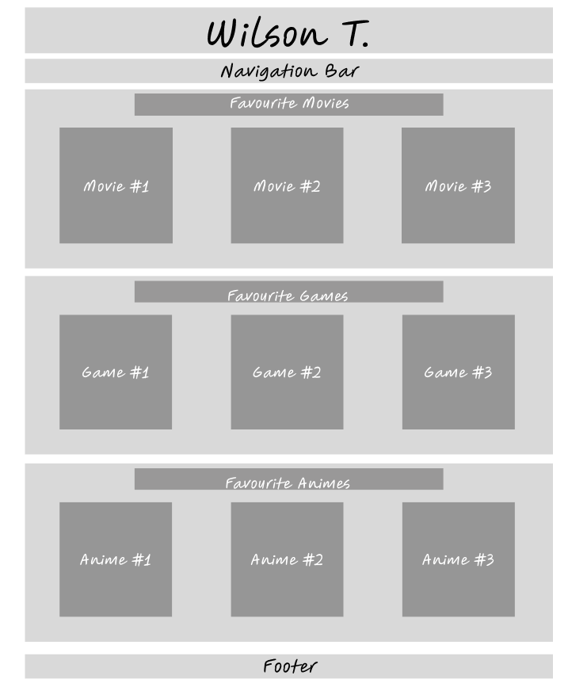
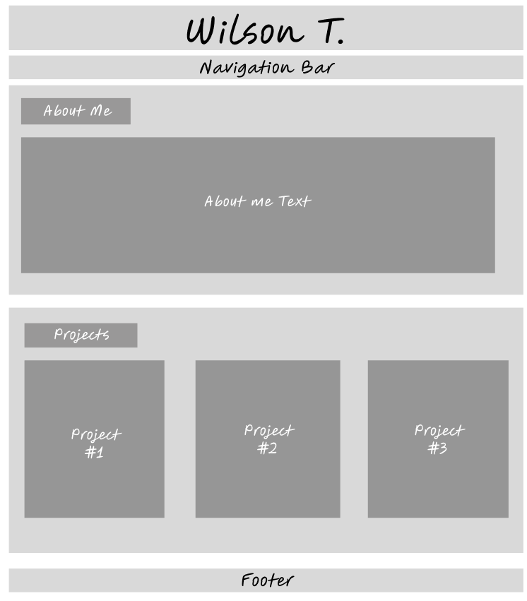

# Mini-Project (45 marks)

[View Instructions Here](Mini-project.md)

[How to use Github / How to submit](https://parsa-rajabi.github.io/CMPT-276/#/assignment-lab-details?id=submission)

For this lab, you will include all of your "answers" in this README file. Make sure to cite any sources you use. 

## Task 0: Declare your AI Usage

After you completed this lab, make sure to submit the AI declaration form via MS Form and also upload a PDF copy of your responses to this repository and include the link to PDF in this README file. Note, you must submit this form regardless if you use AI or not. Failure to submit this form will be considered a violation of AI course policy. More details about the AI-usage course policy can be found [here](https://parsa-rajabi.github.io/CMPT-276/#/ai-policy).

[Link to AI Usage Disclosure MS Form](https://parsa-rajabi.github.io/CMPT-276/#/ai-policy?id=disclosure-of-ai-use)

- You will need to log in with your SFU email to access the form.

Name the file in the following format: 

`Mini_Project_AI_Declaration_FirstName_LastName_StudentID.pdf`

Example (Mini Project):

`Mini_Project_AI_Declaration_Parsa_Rajabi_123456789.pdf`


More detailed submission instructions can be found via the [lab page](https://parsa-rajabi.github.io/CMPT-276/#/labs).

## Task 1: Website Wireframe

Include screenshots of your website wireframe here. Make sure the wireframe is clear and easy to understand/read. To compliment your wireframes, describe the layout and how the elements are organized. Screenshots that are blurry or hard to read will be penalized. 

In addition to the screenshots, you can also a link to your wireframe file (if you used an online tool to create it). Make sure the link is accessible to the teaching team (check using an incognito window). This is not a replacement for the screenshots, but an additional resource for the teaching team to understand your wireframe.

1. **Homepage Wireframe**  
   
   
   The Main Page uses a grid layout with a sidebar for greetings and icons, a central section for an introduction and quote, and another sidebar for navigation. Additional sections display time, programming languages, and contact info.

2. **Interests Page Wireframe**  
   

   The Interests Page organizes content into three sections: "Favourite Movies," "Favourite Games," and "Favourite Animes," each with three grid items for images and descriptions.

3. **About Me Page Wireframe**  
   

   The About Page highlights an "About Me" section for a personal description and a "Projects" section with three boxes for showcasing work.

## Task 2: Follow-up Questions

For this task, please include your answers for the questions described in [Lab 4](L4.md) file below:

### Q1

[Insert answer here]

### Q2

My website includes the following elements:
- **Home Page**: Displays an introduction and navigation to other sections.
- **About Me**: Contains details about me and my interest/purpose.
- **Interests Page**: Lists my interests with visuals.
- **Contact Info**: Displays links to GitHub and LinkedIn.
- **Languages/Frameworks**: A scrolling carousel showing my tech stack.

### Q3

A favicon is a small icon associated with a webpage, typically displayed in the browser tab. It improves SEO because it enhances the user experience, helps brand recognition, and signals to search engines that the website is professional.

### Q4

GitHub Pages is a free hosting service provided by GitHub to publish static websites directly from a GitHub repository. It differs from a regular webpage because it is designed to work seamlessly with Git repositories and does not require an external hosting provider.

### Q5

GitHub Actions is a CI/CD tool provided by GitHub to automate workflows like building, testing, and deploying projects. Here's an example of a `.yml` file:
```yml
name: Deploy Website

on:
  push:
    branches:
      - main

jobs:
  build:
    runs-on: ubuntu-latest
    steps:
      - name: Checkout repository
        uses: actions/checkout@v2

      - name: Build website
        run: npm run build

### Q6

Technology Stack: HTML, CSS, JavaScript.
Reason: These tools are beginner-friendly, widely used, and suited for static websites.

## Task 3: Github Video

For this task, please include your answers for the questions described in [Lab 4](L4.md) file below:

### Q1

Pull requests (PRs) are a feature in GitHub that allow developers to propose changes to a codebase. These changes are submitted from a branch into another branch (e.g., from a feature branch to main). The purpose of PRs is to enable collaboration, as they allow team members to review, discuss, and approve changes before merging them.

### Q2

Green indicates lines of code that have been added in the pull request.
Red indicates lines of code that have been removed or modified in the pull request.

### Q3

#### 3a

The command git merge test merges the changes from the test branch into the current branch (develop). This means Git will attempt to integrate any commits on the test branch into the develop branch. If there are no conflicts, the merge will complete automatically. Otherwise, Git will report merge conflicts that need to be resolved manually.

#### 3b

The message appeared because of a merge conflict. This occurs when Git cannot automatically resolve differences between the develop and test branches. Specifically, the conflicting lines in the README.md file were edited differently in both branches, and Git requires manual intervention to decide which changes to keep.

#### 3c

Lines 2-3 (this is some content to mess with and content to append) belong to the develop branch (current branch).
Lines 5 (totally different content to merge later) belongs to the test branch.